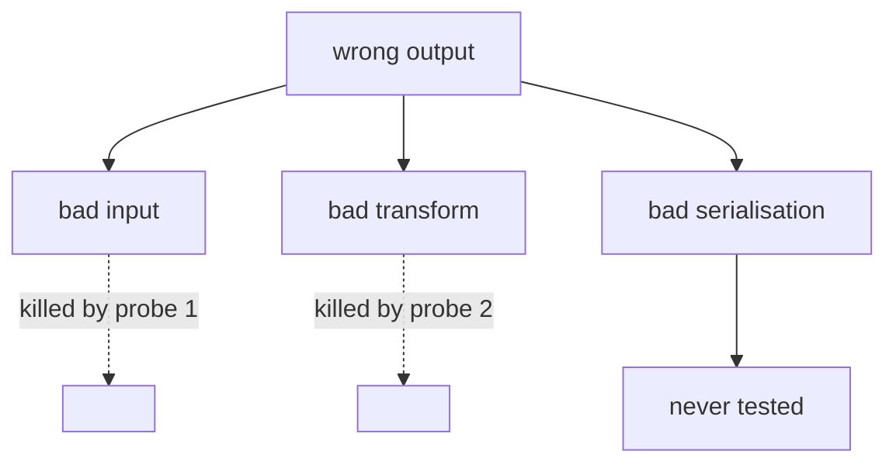

# Interview debug

Two other skills on this machine debug well and assume you eventually win. This one decides
**what ships when the bug wins**.

**Shape every report to `~/.claude/skills/readable-output/SKILL.md`.** The user is dyslexic and
reads these under a clock. Those caps are the source of truth for output shape.

Stamp `date +%s` at entry.

A parent run hands you three things:

- **The start stamp and total budget.** The tripwire reads the clock against them.
- **The MVP label** of the unit that broke. The abandon protocol reads it per unit.
- **The latest checkpoint SHA.** That is what a revert falls back to.

Ask for any it did not send.

Standalone, the stamp at entry **is** the start. There is no label, and nothing to revert to.

## Branch

**mine** — a build in progress broke. The assumptions are already in your context, and
re-deriving them costs the clock. Go to **The loop**.

**theirs** — the task itself is a broken repo. Take the two entry steps below first.

### theirs — entry (~3 min)

Dispatch `Explore` to map the repo while you read the failure output yourself.

It maps three things: the entry point, the failing tests' subject, and what the suite covers.

This is the one place a cold agent pays. It has nothing to inherit, so it can read breadth-first
while you read depth-first.

Then hold a **mini-gate**: list every failing test and label it.

- **must** — the headline break. The submission is nothing without it.
- **should** — fix while time allows.

That is your MVP cut. The abandon protocol reads it per test.

## The loop

Get a **tight** command that goes **red** on this bug. One you have already run, whose output you
have already seen.

In an interview repo it is one of three:

1. The failing test you already have.
2. `python3 -c` / `node -e` calling the function directly with the failing input.
3. A print at the boundary between the last value you trust and the first you do not.

On the **mine** branch the failing test usually is the loop. Recognise that and move on.

## Hypotheses

Rank three to five candidate causes before probing any of them. Otherwise the first plausible
idea anchors the search.

Each one states its prediction:

> If `X` is the cause, then changing `Y` makes the bug disappear.

A hypothesis with no prediction is a vibe. Sharpen it or drop it.

Probe one variable at a time.

Tag every line you add `[DEBUG-a4f2]`, a fresh four-hex tag per run. Cleanup is then a single
grep.

## The tree

Draw it when you are **about to guess again after two failures**. That means the **mine** branch
before two-thirds, and the **theirs** branch at any point.

Two wrong predictions means the true cause was never on your list.

You have been sampling from a set that does not contain the answer. A third guess drawn from it
is worth less than the first.

The tree forces you to name the branches. Mark which ones the probes actually eliminated. Then
look at what you never enumerated.

```mermaid
flowchart TD
  B[wrong output] --> H1[bad input]
  B --> H2[bad transform]
  B --> H3[bad serialisation]
  H1 -. killed by probe 1 .-> X1[ ]
  H2 -. killed by probe 2 .-> X2[ ]
  H3 --> N[never tested]
```

Past two-thirds on the **mine** branch there is no next guess. Skip the tree and go straight to
the abandon protocol.

## ⚠️ Tripwire

| Branch | Trips on |
|---|---|
| mine, before two-thirds of budget | two tested hypotheses, both wrong |
| mine, after two-thirds | one |
| theirs | reaching two-thirds, whatever the count |

The counter measures your model of the system, not your luck.

The clock tightens it because the abandon protocol needs minutes to land. A second probe at
minute 50 spends them.

The **theirs** branch trips on the clock alone. There is no smaller working thing to fall back
to. So there is no reason to stop guessing while time remains.

## Abandon protocol

### mine — read the label from the parent's MVP cut

**should / could** — revert to the parent's last checkpoint. Log one line for the README, and
carry on without interrupting the user.

They labelled it disposable at minute 8. Do not make them re-decide at minute 50.

**must** — stop and put both options to them, costed, with your recommendation:

- **Revert** — the submission runs clean, the feature is gone, a **must** goes unmet.
- **Fence** — guard or skip the failing path so nothing crashes, and document the bug precisely.
  The work stays visible. A leaking fence means the grader hits a crash.

Say plainly that this is the pipeline's **second stop**.

`ai-interview` promised one, and the exception is deliberate. It fires only when a **must** is at
risk — the outcome the gate existed to prevent.

### theirs — write the diagnosis

Reverting returns their repo untouched. So there is nothing to fall back to, and the write-up is
the submission.

For a **should** test, drop the partial attempt and move to the next one.

For the **must** test, write:

- The symptom, precisely.
- Each hypothesis you eliminated and the probe that killed it.
- Your best remaining hypothesis.
- What you would try next.

A grader reading that scores engineering judgement, which is often what the exercise was for.

## Cleanup

Run `grep -rn '\[DEBUG-' .` and remove every probe. Re-run the loop.

Then hand back to the parent with two lines:

- what state the tree is in
- what belongs in the README's **Known limitations**
